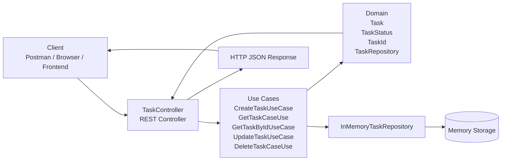

# Task Manager API

A beginner-friendly Spring Boot API for managing tasks.

This project was built to help understand how a REST API works in practice: receiving HTTP requests, validating data, applying business rules, and returning JSON responses.

## What this project does

This API allows you to:

- create a task
- list all tasks
- get one task by ID
- update a task
- delete a task

The application uses an in-memory repository, which means the tasks are stored while the app is running. It is a great example for learning API structure before moving to a real database such as PostgreSQL or MySQL.

## Why this project is useful for learning

If you are new to APIs, this project is a very practical example because it shows the full flow of a request:

1. A client calls an endpoint like `POST /tasks`
2. The controller receives the request
3. The controller maps the JSON body to a request object
4. A use case handles the business logic
5. The task is saved in the repository
6. The server returns a response in JSON

This is the same pattern used in many real-world backend systems.

## Project architecture

This project follows a simple layered architecture:

- Controller layer: receives HTTP requests
- Application layer: contains the business use cases
- Domain layer: contains the task model and business rules
- Infrastructure layer: repository implementation and HTTP request/response objects

## Diagram



You can also think of it like this:

Client -> API Controller -> Business Logic -> Repository -> Data -> Response

## Main layers in the code

### 1. Domain
The domain layer contains the core concepts of the app:

- `Task`
- `TaskId`
- `TaskStatus`
- `TaskRepository`

This is where the real business model lives.

### 2. Application
The application layer contains the logic that orchestrates operations, such as:

- creating a task
- fetching all tasks
- finding a task by ID
- updating a task
- deleting a task

Each use case does one responsibility, which makes the code easier to understand.

### 3. Infrastructure
This layer is responsible for technical details:

- HTTP requests and responses
- validation of input data
- repository implementation in memory
- exception handling

### 4. HTTP controller
`TaskController` exposes the endpoints for the API.

## Available endpoints

Base path:

`/tasks`

### Create task
- Method: `POST`
- Endpoint: `/tasks`
- Body example:

```json
{
  "title": "Study Java",
  "description": "Review Spring Boot and REST APIs"
}
```

### List all tasks
- Method: `GET`
- Endpoint: `/tasks`

### Get task by ID
- Method: `GET`
- Endpoint: `/tasks/{id}`

### Update task
- Method: `PATCH`
- Endpoint: `/tasks/{id}`
- Body example:

```json
{
  "title": "Study Java and Spring Boot",
  "description": "Finish the API exercises",
  "status": "IN_PROGRESS"
}
```

### Delete task
- Method: `DELETE`
- Endpoint: `/tasks/{id}`

## Task status values

The task can be in one of these states:

- `PENDING`
- `IN_PROGRESS`
- `COMPLETED`

## Example response

```json
{
  "id": "1d3d7e50-4fb4-41a0-a6d6-0afad2d5c8c8",
  "title": "Study Java",
  "description": "Review Spring Boot and REST APIs",
  "status": "PENDING"
}
```

## Error handling

This project includes a global exception handler to return proper responses when something goes wrong. For example:

- if a task is not found, it returns `404 Not Found`
- if the request body is invalid, it returns `400 Bad Request`

## Technologies used

- Java 21
- Spring Boot 3 / 4
- Spring Web
- Spring Validation
- Lombok
- Maven

## Project structure

```text
taskManager/
├── src/
│   ├── main/
│   │   ├── java/
│   │   │   └── taskmanager/
│   │   │       ├── application/
│   │   │       │   ├── input/
│   │   │       │   ├── output/
│   │   │       │   ├── CreateTaskUseCase.java
│   │   │       │   ├── GetTaskCaseUse.java
│   │   │       │   ├── GetTaskByIdUseCase.java
│   │   │       │   ├── DeleteTaskCaseUse.java
│   │   │       │   └── UpdateTaskUseCase.java
│   │   │       ├── domain/
│   │   │       │   ├── Task.java
│   │   │       │   ├── TaskId.java
│   │   │       │   ├── TaskRepository.java
│   │   │       │   ├── TaskStatus.java
│   │   │       │   └── TaskNotFoundExecption.java
│   │   │       ├── infrastructure/
│   │   │       │   ├── InMemoryTaskRepository.java
│   │   │       │   └── http/
│   │   │       │       ├── request/
│   │   │       │       ├── response/
│   │   │       │       ├── GlobalExecptionHandler.java
│   │   │       │       └── TaskController.java
│   │   │       └── TaskManagerApplication.java
│   │   └── resources/
│   │       └── application.properties
│   └── test/
│       └── java/
│           └── taskmanager/
│               └── TaskManagerApplicationTests.java
├── pom.xml
├── mvnw
├── mvnw.cmd
├── README.md
└── HELP.md
```

## How to run the project

From the project root, run:

```bash
./mvnw spring-boot:run
```

On Windows, you can also run:

```powershell
mvnw.cmd spring-boot:run
```

Then open the API in your browser or use Postman at:

```text
http://localhost:8080/tasks
```

## How to test the API

You can test it with Postman, curl, or any frontend application.

Example with curl:

```bash
curl -X POST http://localhost:8080/tasks \
  -H "Content-Type: application/json" \
  -d '{"title":"Study Java","description":"Review Spring Boot"}'
```

## What I learned from this project

This project is a great introduction to backend development because it shows:

- how HTTP methods work (`GET`, `POST`, `PATCH`, `DELETE`)
- how JSON request and response bodies are structured
- how controllers act as API entry points
- how business logic is separated from the data layer
- how validation and error handling improve the API
- how to organize a simple project in Java and Spring Boot

## Next steps

If you want to continue learning, these are great next improvements:

- connect to a real database
- add pagination and filtering
- create a frontend to consume the API
- add authentication and authorization
- add unit and integration tests for each use case

## Conclusion

This project is a simple but strong example of a REST API built with Java and Spring Boot. It is ideal for students who are starting to learn backend development and APIs.

It shows the main ideas in a way that is easy to follow and apply to larger systems in the future.

---

Made for learning, experimenting, and building stronger API skills.

